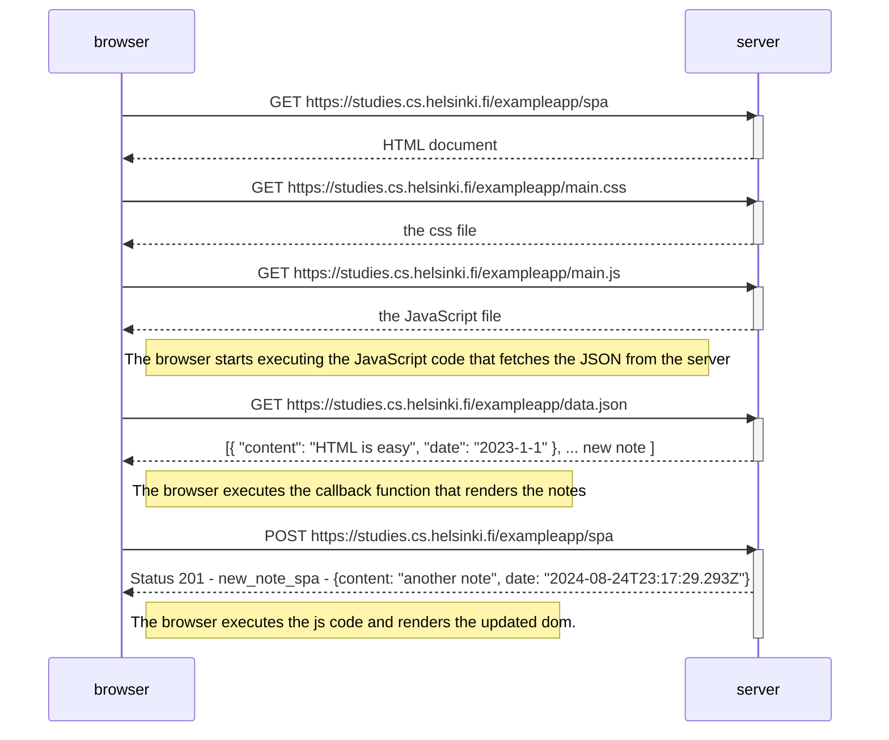

```mermaid
 sequenceDiagram
 participant browser
 participant server

 browser->>server: GET https://studies.cs.helsinki.fi/exampleapp/spa
 activate server
 server-->>browser: HTML document
 deactivate server

 browser->>server: GET https://studies.cs.helsinki.fi/exampleapp/main.css
 activate server
 server-->>browser: the css file
 deactivate server

 browser->>server: GET https://studies.cs.helsinki.fi/exampleapp/main.js
 activate server
 server-->>browser: the JavaScript file
 deactivate server

 Note right of browser: The browser starts executing the JavaScript code that fetches the JSON from the server

 browser->>server: GET https://studies.cs.helsinki.fi/exampleapp/data.json
 activate server
 server-->>browser: [{ "content": "HTML is easy", "date": "2023-1-1" }, ... new note ]
 deactivate server

 Note right of browser: The browser executes the callback function that renders the notes

 browser->>server: POST https://studies.cs.helsinki.fi/exampleapp/spa
 activate server
 server-->>browser: Status 201 - new_note_spa - {content: "another note", date: "2024-08-24T23:17:29.293Z"}
  Note right of browser: The browser executes the js code and renders the updated dom.
 deactivate server
```
